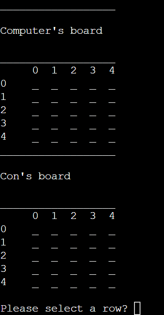
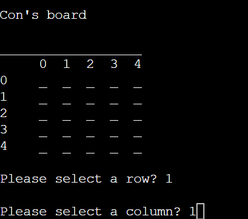
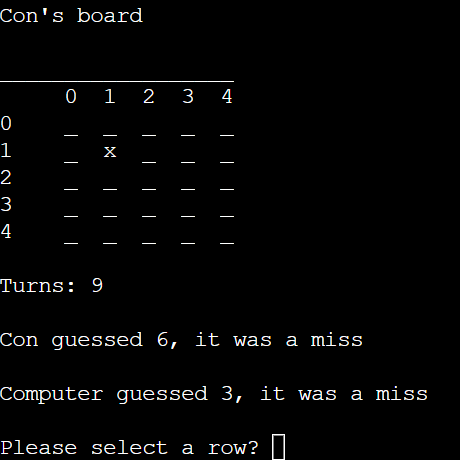
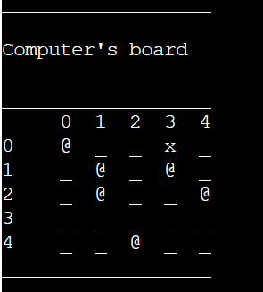
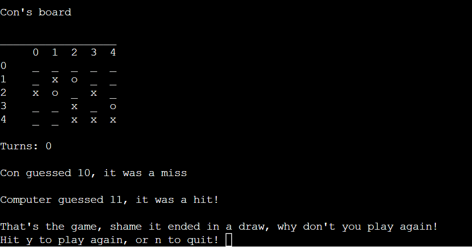
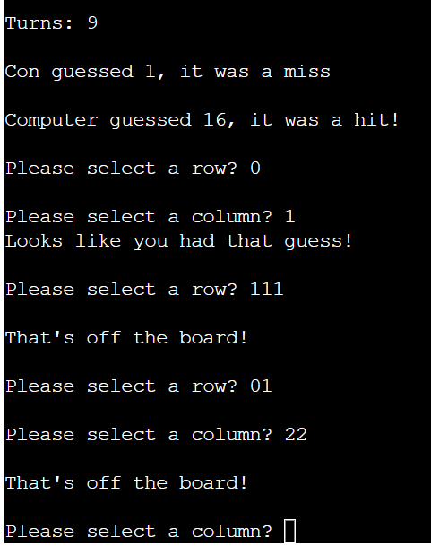
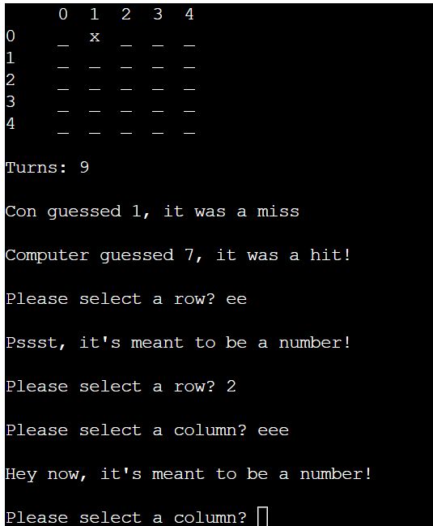
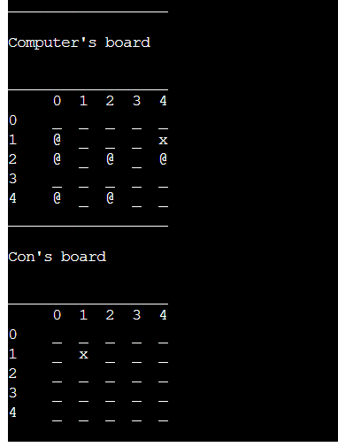
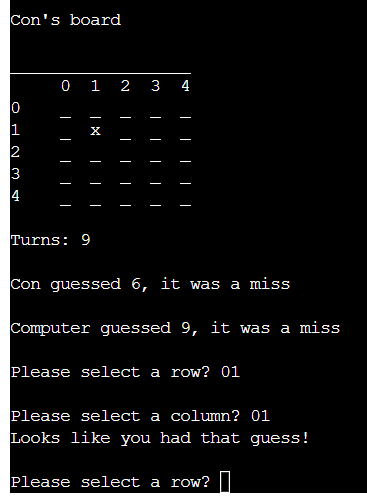
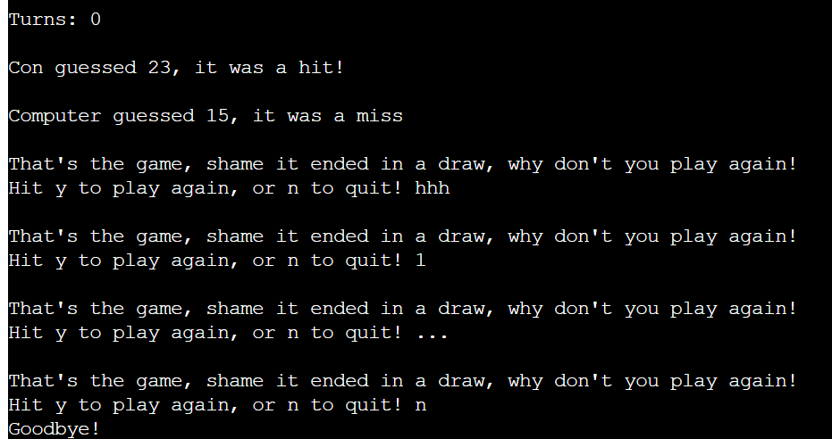

# Battleships

Battleships is a Python game that runs on the Code Institute mock terminal on Heroku. Players can win the game by finding the computer’s battleships before the computer finds theirs. The players take turns to guess spots on a map and try to hit all the spots where their enemy's ships are hiding! 

[More information about Battleships](https://en.wikipedia.org/wiki/Battleship_(game))

[Live version of the project](https://connall-battleship-38f220f5a45e.herokuapp.com/)

## How to play

In our version, the player will be greeted with instructions/rules for how to play. The game works like this: you’ll be asked to input your name, and two boards will be shown, yours and the computer's. You will be guessing on your board, and the computer on theirs. You have ten turns to guess all six of the spots. If you succeed, you win; if the computer does it before you, you lose. If you find all the ships at the same time as your opponent, or if you run out of turns, it’s a draw!

I do want to note that this version ends in a draw if either player does not sink all ships in the given time, this was done to add a challenge to the traditional game.

### Existing features

#### Opening screen - instructions

The player is met with some instructions to read through to play the game.

#### Enter your name

The player has the chance to enter their name. The game cannot start without this, and there is code in place to ensure the entered data is valid.

#### Boards being printed

Two boards will be printed, players and computers, with coordinates from 0-4 on the row and the column.

#### Enter a guess

The player is then asked to enter a row and a column to select. If you select a letter or a number out of the range, you’ll be asked to enter it again.

#### Board print & scores updated

Now you’ll see the boards being printed, with the points updated too. For example, if you guessed 22 and it was a miss, the point that is 22 will now be represented by a “x” and no longer a “_”. You will also see the computer's guess and board the same, alongside two lines which tell you where each guess was and if it was a miss or a hit. Then if applicable, you’ll know if all the ships were sank, and who won, or if the turns have run out, that you can start the game again, or simply just moving onto the next turn and being asked for another row and column. You can also see the @ being represented on the Computers board, which show your ships.

#### Play again

You’ll get an option to play the game again if it comes to an end. This will restart the game if you wish. It is also able to handle input data that is not valid and keep going until it gets the correct data.

You will also get a goodbye message if you choose to leave. 

### Future features

- Let players change the board size, and how many ships they want to use.
- Let players place the ships themselves.
- Add a player v player mode. 

## Data model

I used the Board as my class, this sets the size of the board, lets us know who’s playing and has a type, which assists with later parts of the code. This class also has a print method, which shows us each player's board and updates the boards after each guess. I used this class as it was the most fitting when it came to this project, as both players have a board.

## Testing

I have manually tested this project by:

1. Passing code through a PEP linter, the only errors I received were about lines in the code being too long, but needed to stay in the project as they were important for the logic.
2. Implemented validation for inputs when it comes to wrong inputs (like numbers off the board or too many characters).
3. Tested the logic in the Code Institute terminal.

### Stories from user experience testing

##### First time user

When I first arrived on the terminal I was greeted with instructions to read for the Battleships game, which were slightly long, but I knew I could come back to them at any time if I needed them.

Next, I was able to enter my three-letter username, and I tried some other data inputs which got a response saying I needed to try again. To make sure there were no errors here, I tried more than three letters and also numbers, but all did not work until I entered the right amount.

Then I saw the boards, mine and the computers. I noticed that my name had been capitalized which was a nice touch. Looking at the boards, I noticed the coordinates started from 0-4, like the instructions said, so it was clear what column or row I would select.

I also tried putting in a guess that was off the grid to check what the result would be. 

Next, I was asked to enter a row and a column to make a guess. Again I tried to put in data other than what was asked, but again I was unable to do so due to the validation requirement of the code.

After I saw the boards printed again with “@” symbols on my board which let me know where my ships were, and if my guess was a hit or a miss, and the same for my opponent, I could see their guess on my board. The last thing I could see was the notes telling me where I had guessed and where the computer had guessed to make the game clearer. There was also a turn counter so I knew how many turns I had left.

Next, I was asked to put in another guess, so I tried my last one, and it told me that I already had made that guess. I was able to enter another guess and see if it landed.

Lastly, when the game was over I was asked if I wanted to continue. After trying more inputs than I was meant to, I was again met with more errors until I put in the right data and I was able to play the game again. Next time when I said I didn’t want to play again I was left with a goodbye.

#### User stories

##### First time visitor

Overall, I found the game to be very straightforward and easy to use. I thought there was a lot of reading for the instructions, but if I had no idea what the game was, I would need them. The input features, the name being displayed and the turn counter were features I thought were helpful. To improve the website, I would like to see the instructions being minimized in some way.

##### Returning visitor

When I returned to the site, I could see the instructions and was hoping for a way to make them smaller or even disappear, maybe to make them show at the start and then disappear. I found using the program very straightforward and would have appreciated if the functions had some delay so when the next stage was happening it had some more bounce to it.

##### Frequent visitor

As a frequent visitor, I now would like to have the instructions hidden and have a way to ask for them if needed. I would also look for a mode where you can make the grid wider, change the turn counter, place your ships, and play against another person.

### Bugs

#### Solved bugs

When running the program, I had an issue with the hits, misses, and boats only showing up on one of the boards. I fixed this by changing the way the program received the data for updating the board in the print board function within the Board class.

#### Remaining bugs

When the program starts, the player isn’t able to see where their ships are until after they’ve made their first turn.

### Validator testing

#### PEP8

The only errors that came back were saying that certain lines were too long, but they’re needed for the code, so I left them in.

## Deployment

GitHub Pages
The project was deployed to GitHub Pages using the following steps:

Log in to GitHub and access the [GitHub Repository](https://github.com/Connall1234/ci-project-three-for-submission.git).
Go to Settings > GitHub Pages > Source > Select "Master Branch."
The published site can be accessed [Here](https://connall-battleship-38f220f5a45e.herokuapp.com/)
Forking the GitHub Repository
Forking the repository creates a copy on your GitHub account for viewing and/or making changes without affecting the original repository. Follow these steps:

Access the [GitHub Repository](https://github.com/Connall1234/ci-project-three-for-submission.git).
Click "Fork" at the top right of the repository.
Making a Local Clone
To clone the repository locally, follow these steps:

Access the [GitHub Repository](https://github.com/Connall1234/ci-project-three-for-submission.git).
Click "Clone or download" and copy the URL under "Clone with HTTPS."
Open Git Bash and navigate to the desired directory.
Enter git clone followed by the copied URL.

The project was deployed using Code Institute mock terminal for Heroku. Here are the steps for deployment:

1. Fork or clone this repository.
2. Create a new Heroku app.
3. Set the buildbacks to Python and NodeJS in that order.
4. Link the Heroku app to the repository.
5. Click on Deploy.

## Credits

I would like to credit Code Institute for the deployment terminal as well as their support and guidance on this project. Wikipedia for the battleship game details. My mentor for their support and guidance. This YouTube tutorial which helped in understanding some of the logic [YouTube Tutorial](https://www.youtube.com/watch?v=Ej7I8BPw7Gk&list=PLpeS0xTwoWAsn3SwQbSsOZ26pqZ-0CG6i).